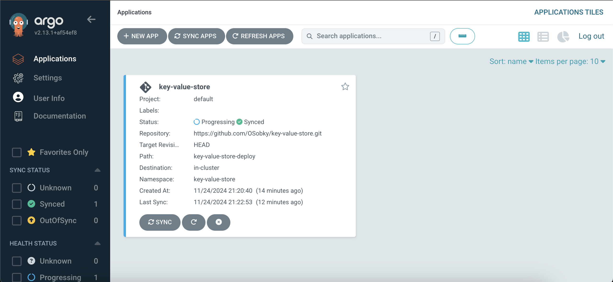

## Getting Started
### Pre-Requisites
- MiniKube cluster with ArgoCD deployed
- key-value-store namespace
    ```bash
    kubectl create namespace key-value-store
    ```

### Deploy Key-Value Store

Now we have ArgoCD deployed on our MiniKube cluster. We can deploy the Key-Value Store with ArgoCD with the following steps:

```bash
argocd login localhost:8080
```

Then to create a new application for the **Key-Value Store** app:

```bash
argocd app create key-value-store --repo https://github.com/OSobky/key-value-store.git --path key-value-store-deploy --dest-server https://kubernetes.default.svc --dest-namespace key-value-store
```

Then to make the sync automated:

```bash
argocd app set key-value-store --sync-policy automated
```

Now when accessing the UI of ArgoCD at [https://localhost:8080/](https://localhost:8080/), you should see the key-value-store app in the application view.


